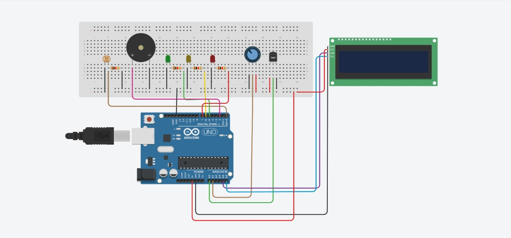

# Checkpoint 2 - O Caso de Luminosidade,Temperatura e Umidade 
Projeto de circuito para uma vinheria que busca automatizar o  <strong>monitoramento de luminosiade, temperatura e umidade </strong> dos vinhos armazenados na adega da vinícula. Utilizando dos conceitos aprendidos em sala de aula e pesquisas sobre o tema.

Veja o vídeo explicativo do projeto 👉 **[Clique aqui!](https://youtu.be/aapwjsI5mDc)**

## 👥 Equipe do Projeto
* Julia Souza Costa Schiavi 
* Thayna Ferreira Lopes 
* Sofia Viegas Bomeny 
* Luís Felipe Scacchetti 
* Leonardo Eiji Kina 

## 💻 Desenvolvimento

### 🛠️ Componentes utilizadas
* Arduíno Uno;
* Protoboard;
* Jumpers;
* Resistores de 10 kΩ;
* Leds: Verde, Amarelo e Vermelho;
* Buzzer; 
* **Display LCD**;
* **Fotorresistor LDR**;
* **DHT11**.

### Explicação 
<dl>

<dt><strong>DHT11</strong></dt>
<dd>O  principal componente  do circuito será o <strong>DHT11 </strong> conectado aos pinos de alimentação: GND, +5V e pinos de entrada e saída . Ele irá medir a temperatura e a umidade  atual do local de modo que com uma lógica adequada podemos definir em qual dos 3 estados representados por Leds <em>(OK / Alerta / Problema)</em> existentes a luz atual se adequa.</dd>

<dd> ---------------------------------------------------------------------------------------- </dd>

<dt><strong> Display LCD </strong></dt>
<dd> O display LCD integrado fornece aos funcionários da vinheria dados exatos de luminosidade, umidade e temperatura da adega. Essa informação precisa permite um controle otimizado desses três fatores, garantindo a qualidade dos vinhos. </dd>

</dl>

### Montagem do circuito
Ambiente simulado para testes do circuito 👉 **[Clique Aqui!](https://www.tinkercad.com/things/a0ueuSYKrwQ-cp2-simulacao/editel?returnTo=https%3A%2F%2Fwww.tinkercad.com%2Fdashboard&sharecode=XgDa580iIKaOwmU4SnaP67ODkN0Mnz5E2Tm4IO2X_o4)**

### 👩‍💻 Código do circuito
O código que executa corretamente o circuito de moniotoramento de luminosidade, temperatura e umidade da vinheira Agnello está na pasta ***codeCP2.ino/*** com um único arquivo chamado **codeCP2.ino** presente. Este arquivo é o que permite a IDE do arduino passar o código ao micro-computador e executar o código corretamente.

Pode também apenas clicar aqui 👉 **[codeCP2.ino](https://github.com/user-mind/projetos-edgecomputing/blob/main/codeCP2.ino)**

## ‼️Informações Importantes

### Intervalos de Luminosidade 
<dl>

<dt><strong>💡Led Verde</strong></dt>
<dd>Ambiente escuro: <em>Led Verde fica aceso</em> --> luminosidade ideal para os vinhos.<dd>

<dt><strong>💡Led Amarelo</strong></dt>
<dd>Ambiente a meia luz: <em><strong>Led Amarelo</strong> aceso com a mensagem exibida no Display LCD de </em> <strong>"Ambiente a meia luz"</strong> --> início do alerta para os funcionários.<dd>

<dt><strong>💡Led Vermelho</strong></dt>
<dd>Ambiente muito claro: <em><strong>Led Vermelho</strong> aceso com a mensagem exibida no Display LCD de </em><strong>"Ambiente muito claro"</strong> --> alerta para os funcionários que a luminosidade está incorreta.<dd>

</dl>

### Intervalos de Temperatura
<dl>

<dt><strong>🌡Temperatura OK</strong></dt>
<dd> <em><strong>Led Verde</strong> aceso com a mensagem exibida no Display LCD de </em> <strong>"Temperatura Ok e o valor da temperatura".</strong><dd>

<dt><strong>🌡Temperatura Alta</strong></dt>
<dd><strong>Led Amarelo</strong> aceso quando a temperatura for acima de 15ºC com uma mensagem exibida no Display LCD de </em> <strong>"Temp. Alta e o valor da temperatura".</strong><dd>

</dl>

### Intervalos de Umidade
<dl>
<dd>🔎Enquanto estiver fora da faixa ideal, o <strong>Led Vermelho continua aceso e o Buzzer deve ligar continuamente!</strong></dd>

<dt><strong>💧Umidade entre 50% e 70%</strong></dt>

<dd>DisplayLCD informa "Umidade OK" e também mostra o valor da umidade.<dd>

<dt><strong>💧Umidade menor que 50%</strong></dt>
<dd><strong>Led Vermelho</strong> aceso com a mensagem exibida no Display LCD de </em><strong>"Umidade.Baixa"</strong> --> alerta para os funcionários que a umidade está incorreta.<dd>

<dt><strong>💧Umidade acima de 70%</strong></dt>
<dd><strong>Led Vermelho</strong> aceso com a mensagem exibida no Display LCD de </em><strong>"Umidade.Alta"</strong> --> alerta para os funcionários que a umidade está incorreta.<dd>

</dl>